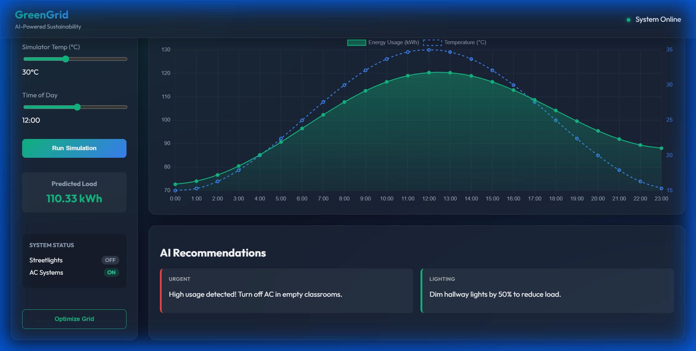

# 🌿 GreenGrid: Campus Energy Optimizer

> **AI-Powered Sustainability for a Greener Future.**  
> *Aligns with SDG 7 (Affordable and Clean Energy) & SDG 11 (Sustainable Cities).*



## 📌 Problem Statement
Universities and large campuses often suffer from energy inefficiencies—lights left on in empty fields, ACs running in unoccupied rooms—leading to massive carbon footprints and high electricity bills. Students and facilities managers often lack real-time visibility and actionable insights to curb this waste.

## 💡 The Solution: GreenGrid
**GreenGrid** is an intelligent energy management dashboard that monitors real-time usage, predicts peak loads, and automates energy controls using AI.

### 🚀 Key Features
- **Real-Time Monitoring**: Interactive line chart analyzing energy usage vs. temperature.
- **🔮 AI Load Prediction**: Machine Learning model (Linear Regression) predicts energy consumption based on time and weather.
- **⚡ Smart Automation**: 
    - **Auto-Streetlights**: Turns ON automatically between 6 PM - 6 AM.
    - **Smart AC**: Activates only when ambient temperature exceeds 25°C.
- **⚖️ Load Balancing**: One-click "Optimize Grid" feature to simulate load shedding and save energy.
- **Suggestions Engine**: Context-aware recommendations to reduce waste (e.g., "Dim hallway lights").

## 🛠️ Tech Stack

### Frontend
- **Vite + Vanilla JS**: Fast, lightweight, and modern.
- **Chart.js**: For beautiful, responsive data visualization.
- **CSS3 (Glassmorphism)**: Premium, dark-mode accessible UI.

### Backend
- **Python / Flask**: Lightweight REST API.
- **Scikit-Learn**: For training the energy prediction model.
- **Pandas/NumPy**: Data processing and synthetic data generation.

## 📂 Project Structure
```
GreenGrid/
├── backend/
│   ├── app.py             # Flask API Endpoints
│   ├── model.py           # ML Model Training & Logic
│   └── requirements.txt   # Python Dependencies
├── frontend/
│   ├── src/
│   │   ├── main.js        # Dashboard Logic & API Calls
│   │   └── style.css      # Glassmorphism Styling
│   └── index.html         # Main Dashboard UI
└── screenshots/           # Demo images
```

## 🔧 Getting Started

### Prerequisites
- Python 3.x
- Node.js & npm

### Installation

1.  **Clone the Repository**
    ```bash
    git clone https://github.com/BIBHU78150/GreenGrid.git
    cd GreenGrid
    ```

2.  **Setup Backend**
    ```bash
    cd backend
    python -m venv venv
    # Windows
    venv\Scripts\activate
    # Mac/Linux
    # source venv/bin/activate
    
    pip install -r requirements.txt
    python model.py  # Train the initial model
    python app.py    # Start the Server (http://127.0.0.1:5000)
    ```

3.  **Setup Frontend** (Open a new terminal)
    ```bash
    cd frontend
    npm install
    npm run dev
    ```

4.  **Access the Dashboard**
    Open your browser and navigate to the URL shown in the terminal (usually `http://localhost:5173`).

## 🌱 Impact & Sustainability
GreenGrid directly supports **United Nations Sustainable Development Goals (SDGs)**:
- **SDG 7**: By optimizing energy use, we ensure affordable and clean energy for campus communities.
- **SDG 13**: Reducing unnecessary consumption lowers the overall carbon footprint.

---
*Built by **Bibhukalyan Nayak** for the 1M1B AI for Sustainability Internship.*
